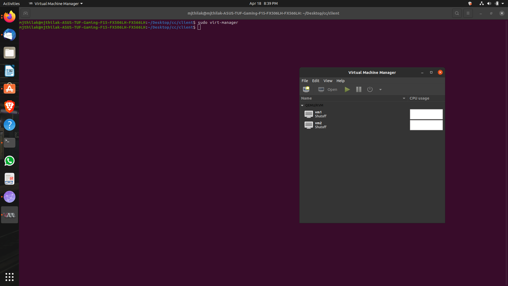
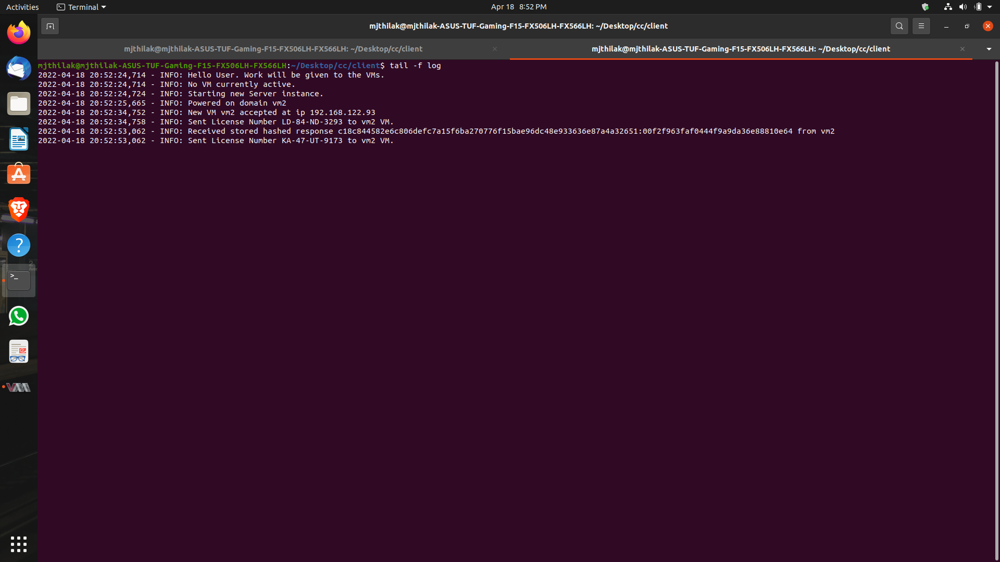
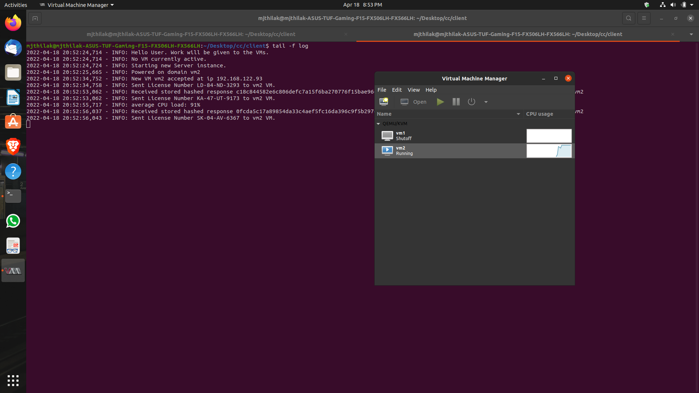
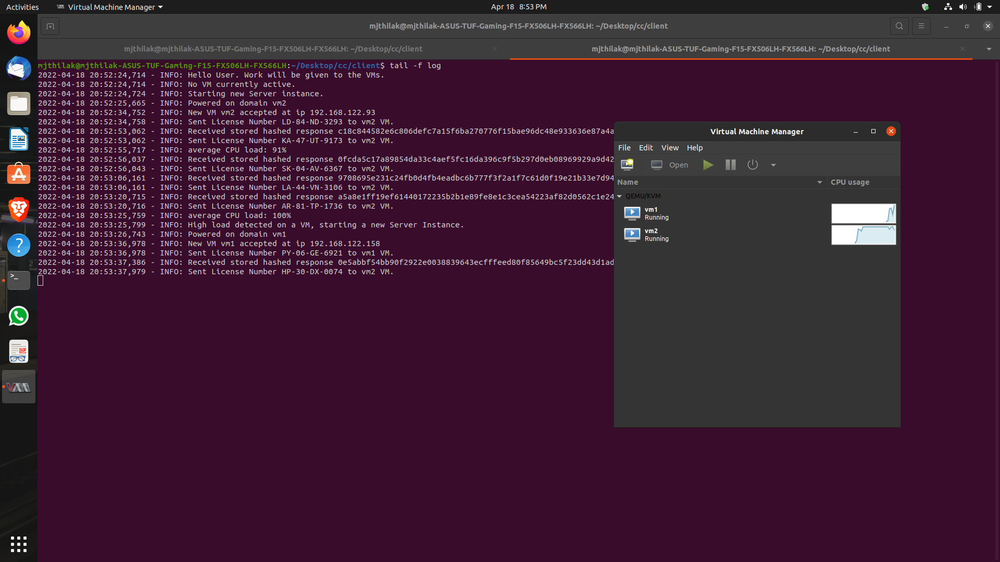
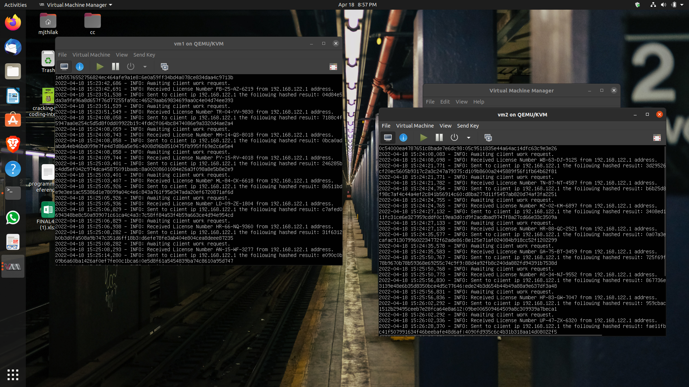
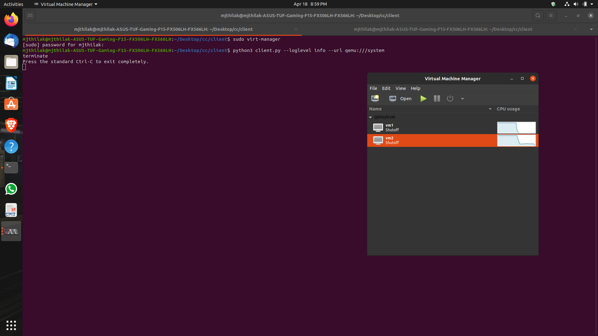

# Cloud Computing Project

<b>Submitted by Group 25</b>

<b>Github Repository Link: https://github.com/vimrajesh/cc/</b>

## Group 25 Members

- Vimal Rajesh (B180336CS)
- P Arjun (B180454CS)
- Kunal Ravikumar Jagtap (B180921CS)
- Sevakula Jyothi (B180359CS)
- Billa Amulya (B180404CS)

## Task

Build your own cloud management system using the libvirt API.

## Introduction

The following is an implementation of an autoscaling system which scales and shifts the load from N virtual machines to N+1 virtual machines to ensure that performance can keep up with the increased incoming load.

We are generating random license numbers and sending it to virtual machine to hash and store safely. This set of computations is used to check the autoscaling component of our code.

## Configuration

You need to setup the following to get started. We did the implementation on Ubuntu 20.04 LTS. You can use any other Linux distribution.

### Initial Installation

Install the following packages:

```bash
sudo apt-get install virt-manager
```

Check whether KVM can be used by running the following command:

```bash
kvm-ok
```

If output is something similar, then we are good to go.
```bash
INFO: /dev/kvm exists
KVM acceleration can be used
```

Then install the rest of the requirements
```bash
sudo apt-get install qemu-kvm libvirt-daemon-system libvirt-clients bridge-utils
```


### Helpful Commands

Check if virtual machines are running:

```bash
virsh list --all
```

### Setting up VMs

- Open virtual machine manager and create a new virtual machine.

    ```bash
    virt-manager
    ```

- Set up a new VM with appropriate configurations of RAM and CPU.

- Name the VM as 'vm-1'.

- Clone the VM and remember to rename the hostname of the new VM to 'vm-2'.

    ```bash
    virsh domrename <old-name> <new-name>
    ```


## Implementation

- Start virt-manager.
    
    <p align="center">
        <i>Figure 1: Virtual Machines Setup Successfully</i>
    </p>
    <br/>

    The following image above shows the two setup VMs.

- Clone the code repository in the client.
    ```bash
    git clone https://github.com/vimrajesh/cc/
    ```

- Clone the code repository in the individual VMs as well.

- Move the server.py code from server directory of the code base to the respective VMs from the server folder to the **'/home/\<VM_name\>'** directory of the VM.

- Move the rc.local file from **'server\\<VM_name\>\rc.local'** to the **'\etc\'** directory.

- Execute the following commands in the directory.
    ```bash
    sudo chown root rc.local
    sudo chmod 777 rc.local
    ```

    The above commands are to make sure that the rc.local file is executable. The rc.local file gets triggered on the boot of the VM instance. The rc.local files looks like this:

    ```bash
    #!/bin/sh -e
    # VM1 rc.local file
    # rc.local
    # 
    # This script is executed at the end of each multiuser runlevel.
    # Make sure that the script will "exit 0" on success or any other
    # value on error.
    #
    # In order to enable or disable this script just change the execution
    # bits.
    #
    # By default this script does nothing.

    /usr/bin/python3 /home/vm1/server.py &
    exit 0
    ```

- Now you can shut down the VMs. And let us move to the client part of the code.

- Make sure you have libvirt port of python and numpy modules installed in client. You can navigate to **'client/'** directory and run the following command to start the client.

    ```bash
    python3 client.py --loglevel info --url qemu:///system
    ```

    

    
    <p align="center">
        <i>Figure 2: Running Client Code</i>
    </p>
    <br/>

- The delta has been set to 1. Delta signifies the inter request time.

- You can follow the log files of the execution in the client end using this command in the same directory.

    ```bash
    tail -f log
    ```

    
    <p align="center">
        <i>Figure 3: Client End Execution Log</i>
    </p>
    <br/>

- The following client code would trigger the **server.py** execution at the server end as specified in the **rc.local** file. The following can be verified using the CPU graph in the virt manager.

    
    <p align="center">
        <i>Figure 4: CPU Load of VM1</i>
    </p>

- Now when the computational load is expensive, and above a certain threshold for a sustained period of time (mean is taken), then the load is shifted to other VM as well. VM2 which was previously shut down is booted and the load is shifted to it.

    
    <p align="center">
        <i>Figure 5 Shifting load to available VM instance</i>
    </p>

- You can also verify the operations at server end by checking the log files at server end. It usually should be in the root directory. You can check them using the following command.
    ```bash
    tail -f log
    ```

    
    <p align="center">
        <i>Figure 6: Server End Execution Log</i>
    </p>
    <br/>

- You can finally end the execution by typing out **terminate** in the client console. It will terminate the execution of the client and shut down the VMs.

    
    <p align="center">
        <i>Figure 7: Terminating Client Code Execution</i>
    </p>
    <br/>

## Conclusion

As you can see, the client code is able to scale up and down the number of VMs. This is a very simple implementation of the autoscaling system which scales and shifts the load from N virtual machines to N+1 virtual machines to ensure that performance can keep up with the increased incoming load.